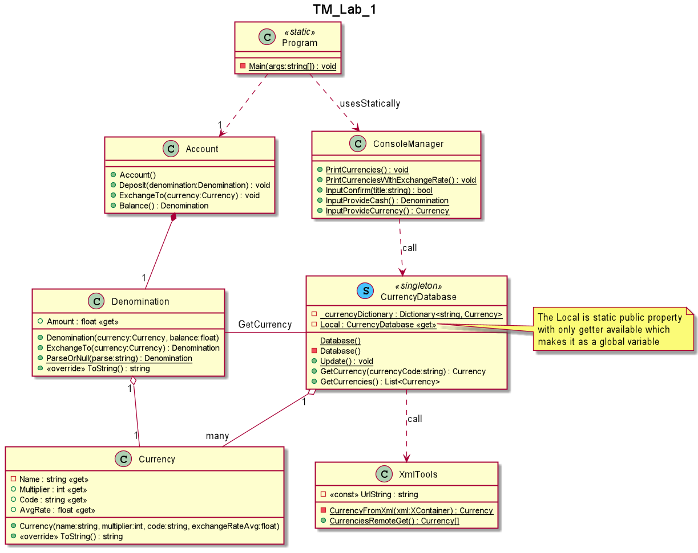

# Techniki Obiektowe LAB 1

## ZADANIE LABORATORYJNE
Narodowy Bank Polski publikuje w witrynie https://www.nbp.pl/kursy/xml/lasta.xml tabelę
średnich kursów walut. Zaprojektować narzędzie umożliwiajace obliczenie wartości końcowej kwoty w dowolnej walucie docelowej po podaniu przez użytkownika dowolnej ilości środka pieniężnego dowolnej waluty źródłowej. 

### UWAGI

1. Dokonać dekompozycji problemu
2. Uwzględnić relacje między klasami w szczególności całość-część
3. Opracować architekturę rozwiazania
4. Uwzględnić zasady SOLID
5. Wykorzystać Singleton
6. Diagram klas UML rozwiazania

## Rozwiązanie:
* [Całość część](CurrencyDatabase.cs#L12-L12)
* [Singleton](CurrencyDatabase.cs#L11-L30)
* 