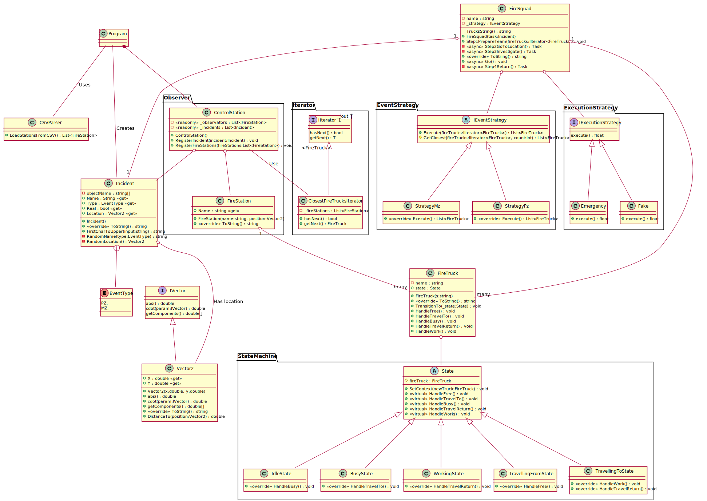

# Techniki Obiektowe LAB 5

## ZADANIE LABORATORYJNE

## Rozwiązanie:

### Opis rozwiązania:
* `Program`
  * worzy `ControlStation` i ładuje do niej `FireStation`-s przy pomocy `CSVParser`-a z pliku .csv. `FireStation`-s domyślnie tworzą w sobie określoną liczbę `FireTruck`-s.
  * co jakiś *losowy* czas tworzony jest `Incident` który ma swoją nazwę, lokalizację oraz typ `MZ` albo `PZ` a także z góry założone czy jest to prawdziwe czy fałszywe zagrożenie
* `ControlStation`
  * odbiera `Incident` następnie tworzy `FireSquad` do którego dodawane są `FireTruck`-s według `IEventStrategy` który szuka najbliższe `2` lub `3` wozy strażackie w zależności od `Incident.Type`
    * Wyszukiwanei `FireTruck` jest przeprowadzane asynchronicznie w `Iterator`-ze, który z przerwami czeka na zwolnienie się `FireTruck` - czyli kiedy otrzyma `IdleStatus`
  * po przygotowaniu `FireSquad` asynchronicznie uruchamia ich działanie
* `FireSquad`
  * dojeżdza na miejsce zdażenia
  * następnie sprawdza `Incident.Real` i w zależności od Typu wybiera `IExecutionStrategy` - automatyczny powrót, lub działanie jeżeli zagrożenie jest prawdziwe
  * po zakończeniu pojazdy wracają do bazy z `IdleStatus`


### UML Diagram



### Przykład uruchomienia z jednym wydarzeniem

```css
ControlStation Registering: FS(Skawina - 4 Trucks)
ControlStation Registering: FS(PSP 1 - 4 Trucks)
ControlStation Registering: FS(PSP 2 - 4 Trucks)
ControlStation Registering: FS(PSP 3 - 4 Trucks)
ControlStation Registering: FS(PSP 4 - 4 Trucks)
ControlStation Registering: FS(PSP 5 - 4 Trucks)
ControlStation Registering: FS(PSP 6 - 4 Trucks)
ControlStation Registering: FS(PSP 7 - 4 Trucks)
ControlStation Registering: FS(Aspir - 4 Trucks)
ControlStation Registering: FS(LSP - 4 Trucks)
ControlStation What's happen? - Incident( Car accident with tree)
Squad(7df19cb6) Preparing Team - Incident( Car accident with tree)
Truck(PSP 2-1), Truck(PSP 2-2), Truck(PSP 2-3) -> Squad(7df19cb6)
Squad(7df19cb6) Travelling To - Incident( Car accident with tree)
Truck(PSP 2-1), Truck(PSP 2-2), Truck(PSP 2-3) -> Incident( Car accident with tree)
Squad(7df19cb6) Investigating Incident( Car accident with tree)
Squad(7df19cb6) Task is Real Incident( Car accident with tree)
Squad(7df19cb6) doing Incident( Car accident with tree)
Truck(PSP 2-1), Truck(PSP 2-2), Truck(PSP 2-3) doing Incident( Car accident with tree)
Squad(7df19cb6) sent crew to bases - Incident( Car accident with tree)
Truck(PSP 2-1), Truck(PSP 2-2), Truck(PSP 2-3) -> Base
Squad(7df19cb6) Done - Incident( Car accident with tree)
```