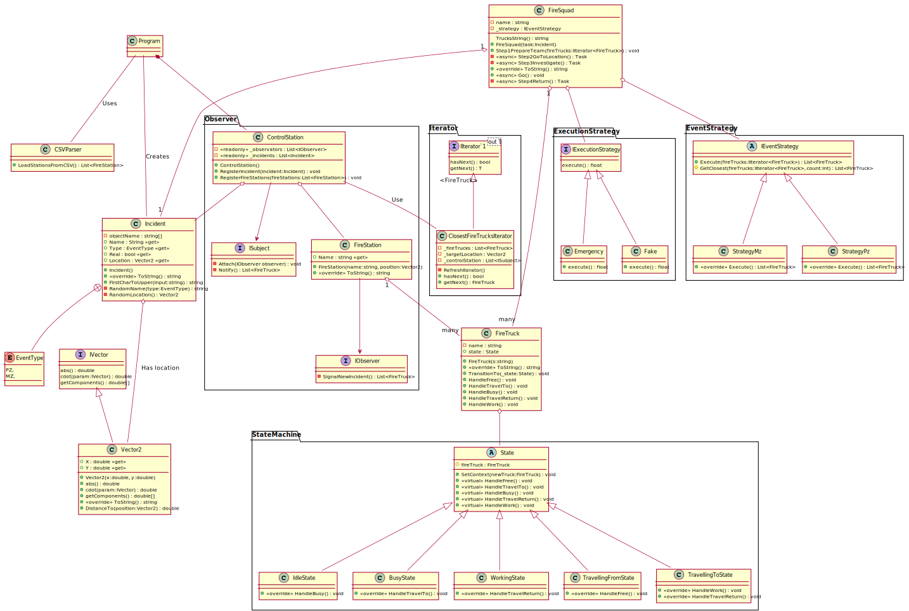

# Techniki Obiektowe LAB 5

## ZADANIE LABORATORYJNE

Przyjmijmy uproszczony model dysponowania jednostek Państwowej Straży Pożarnej na ob-
szarze miasta Krakowa.

Pod nadzorem Stanowiska Kierowania Komendanta Miejskiego w Krakowie (SKKM) znajduje
się siedem ponumerowanych jednostek ratowniczo-ga śniczych (JRG-1:JRG-7), JRG Szkoły Aspi-
rantów PSP, JRG Skawina oraz LSP Lotniska w Balicach. Dla uproszczenia modelu problemu
przyjmijmy, że każda jednostka posiada 5 samochodów, które mogą być dysponowane do zdarzeń,
niezależnie od ich charakteru.

Do SKKM co jaki ś czas drogą telefoniczną napływają zgłoszenia różnych zdarzeń takich jak:
pożary (PZ), alarmy fałszywe (AF) oraz inne miejscowe zagrożenia (MZ). 70 procent zgłoszeń
dotyczy miejscowych zagrożeń, a 30 procent pożarów. Na potrzeby tego modelu przyjmijmy,że
dowolne zdarzenie charakteryzuje się rodzajem (PZ, AF, MZ) oraz jego położeniem (współrzędne
geograficzne w stopniach dziesiętnych układu WGS-84).

SKKM powiadamia o zdarzeniu jednostki jej podległe o zaistnieniu zdarzenia. W przypadku
charakteru PZ wyjeżdżają trzy samochody, a MZ dwa (z jednostki znajdującej się najbliżej miejsca
zdarzenia). W momencie wyjazdu do zdarzenia samochody zmieniają swój stan z wolnego na
zajęty, do momentu zakończenia działań i powrotu do jednostki macierzystej. Tylko samochody
w stanie wolnym mogą zostać zadysponowane do zdarzenia. W momencie, w którym w na-
jbliższej miejscu zdarzenia jednostce braknie wolnych pojazdów, dysponowane są te z kolejnych
najbliższych jednostek.

Po dojeździe na miejsce zdarzenia (losowy czas 0-3s) zdarzenie może okazać się alarmem fałszy-
wym (prawdopodobienstwo 5 procent). W sytuacji alarmu fałszywego samochody automatycznie
powracają do swoich jednostek (losowy czas dojazdu 0-3s). W przypadku przeciwnym, pode-
jmują działania, które trwają losowy czas w przedziale (5-25s), po czym wracają do swoich
jednostek (losowy czas dojazdu 0-3s). Po powrocie ich stan ustawiany jest na wolny.


## Rozwiązanie:

### Opis rozwiązania:
* `Program`
  * worzy `ControlStation` i ładuje do niej `FireStation`-s przy pomocy `CSVParser`-a z pliku .csv. `FireStation`-s domyślnie tworzą w sobie określoną liczbę `FireTruck`-s.
  * co jakiś *losowy* czas tworzony jest `Incident` który ma swoją nazwę, lokalizację oraz typ `MZ` albo `PZ` a także z góry założone czy jest to prawdziwe czy fałszywe zagrożenie
* `ControlStation`
  * odbiera `Incident` następnie tworzy `FireSquad` do którego dodawane są `FireTruck`-s według `IEventStrategy` który szuka najbliższe `2` lub `3` wozy strażackie w zależności od `Incident.Type`
    * Wyszukiwanei `FireTruck` jest przeprowadzane asynchronicznie w `Iterator`-ze, który z przerwami czeka na zwolnienie się `FireTruck` - czyli kiedy otrzyma `IdleStatus`
  * po przygotowaniu `FireSquad` asynchronicznie uruchamia ich działanie
* `FireSquad`
  * dojeżdza na miejsce zdażenia
  * następnie sprawdza `Incident.Real` i w zależności od Typu wybiera `IExecutionStrategy` - automatyczny powrót, lub działanie jeżeli zagrożenie jest prawdziwe
  * po zakończeniu pojazdy wracają do bazy z `IdleStatus`


### UML Diagram

[Link Do UML w osobnej karcie z możliwością zoomowania](https://raw.githubusercontent.com/john-bartu/cut-oot/master/TO_Lab_5/TO_LAB_5.svg)


### Przykład uruchomienia z jednym wydarzeniem

```css
ControlStation Registering: FS(Skawina - 5 Trucks)
ControlStation Registering: FS(PSP 1 - 5 Trucks)
ControlStation Registering: FS(PSP 2 - 5 Trucks)
ControlStation Registering: FS(PSP 3 - 5 Trucks)
ControlStation Registering: FS(PSP 4 - 5 Trucks)
ControlStation Registering: FS(PSP 5 - 5 Trucks)
ControlStation Registering: FS(PSP 6 - 5 Trucks)
ControlStation Registering: FS(PSP 7 - 5 Trucks)
ControlStation Registering: FS(Aspir - 5 Trucks)
ControlStation Registering: FS(LSP - 5 Trucks)
ControlStation What's happen? - Incident( Car accident with tree)
Squad(7df19cb6) Preparing Team - Incident( Car accident with tree)
Truck(PSP 2-1), Truck(PSP 2-2), Truck(PSP 2-3) -> Squad(7df19cb6)
Squad(7df19cb6) Travelling To - Incident( Car accident with tree)
Truck(PSP 2-1), Truck(PSP 2-2), Truck(PSP 2-3) -> Incident( Car accident with tree)
Squad(7df19cb6) Investigating Incident( Car accident with tree)
Squad(7df19cb6) Task is Real Incident( Car accident with tree)
Squad(7df19cb6) doing Incident( Car accident with tree)
Truck(PSP 2-1), Truck(PSP 2-2), Truck(PSP 2-3) doing Incident( Car accident with tree)
Squad(7df19cb6) sent crew to bases - Incident( Car accident with tree)
Truck(PSP 2-1), Truck(PSP 2-2), Truck(PSP 2-3) -> Base
Squad(7df19cb6) Done - Incident( Car accident with tree)
```