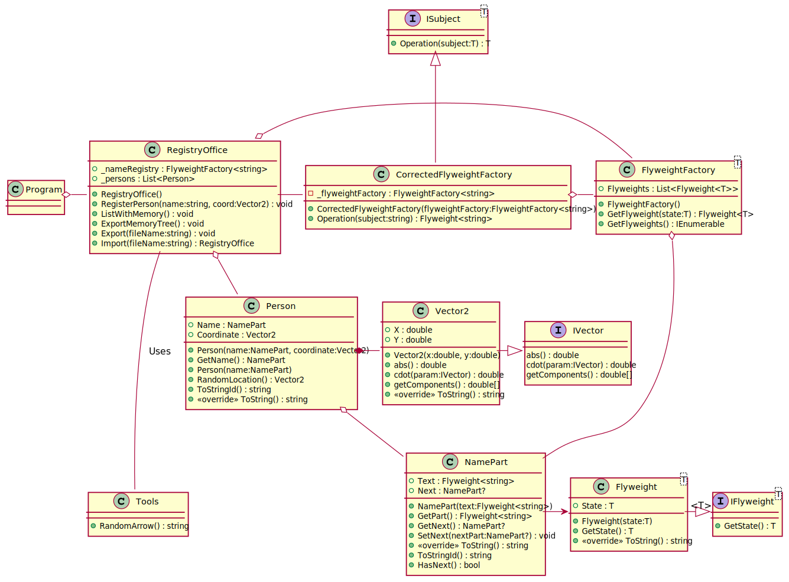

# Techniki Obiektowe LAB 6

## ZADANIE LABORATORYJNE

## Rozwiązanie:

### Opis rozwiązania:

### UML Diagram

[Link Do UML w osobnej karcie z możliwością zoomowania](https://raw.githubusercontent.com/john-bartu/cut-oot/master/TO_Lab_6/TO_LAB_6.svg)


### Przykład uruchomienia z jednym wydarzeniem

```azure
Registry Adding: [Marcin Artem Marcol]
Name fixing           Marcin =>           Marcin
Flyweight [          Marcin] create in memory
Name fixing            Artem =>            Artem
Flyweight [           Artem] create in memory
Name fixing           Marcol =>           Marcol
Flyweight [          Marcol] create in memory
Registry Added: [Marcin Artem Marcol]

Registry Adding: [Karol Karol Marcol Boczar]
Name fixing            Karol =>            Karol
Flyweight [           Karol] create in memory
Name fixing            Karol =>            Karol
Flyweight [           Karol] load from memory
Name fixing           Marcol =>           Marcol
Flyweight [          Marcol] load from memory
Name fixing           Boczar =>           Boczar
Flyweight [          Boczar] create in memory
Registry Added: [Karol Karol Marcol Boczar]

Registry Adding: [Marcin OskAr Jarosz Zubek Łęczycki]
Name fixing           Marcin =>           Marcin
Flyweight [          Marcin] load from memory
Name fixing            OskAr =>            Oskar
Flyweight [           Oskar] create in memory
Name fixing           Jarosz =>           Jarosz
Flyweight [          Jarosz] create in memory
Name fixing            Zubek =>            Zubek
Flyweight [           Zubek] create in memory
Name fixing         Łęczycki =>         Łęczycki
Flyweight [        Łęczycki] create in memory
Registry Added: [Marcin Oskar Jarosz Zubek Łęczycki]

Registry Adding: [Karol Marcol Zubek]
Name fixing            Karol =>            Karol
Flyweight [           Karol] load from memory
Name fixing           Marcol =>           Marcol
Flyweight [          Marcol] load from memory
Name fixing            Zubek =>            Zubek
Flyweight [           Zubek] load from memory
Registry Added: [Karol Marcol Zubek]

Registry Adding: [OskAr Zubek Łęczycki]
Name fixing            OskAr =>            Oskar
Flyweight [           Oskar] load from memory
Name fixing            Zubek =>            Zubek
Flyweight [           Zubek] load from memory
Name fixing         Łęczycki =>         Łęczycki
Flyweight [        Łęczycki] load from memory
Registry Added: [Oskar Zubek Łęczycki]

Registry Adding: [Karol Szymon Łęczycki]
Name fixing            Karol =>            Karol
Flyweight [           Karol] load from memory
Name fixing           Szymon =>           Szymon
Flyweight [          Szymon] create in memory
Name fixing         Łęczycki =>         Łęczycki
Flyweight [        Łęczycki] load from memory
Registry Added: [Karol Szymon Łęczycki]

Registry Adding: [Karol Jan OskAr Kocjan Szcześniak Jarosz]
Name fixing            Karol =>            Karol
Flyweight [           Karol] load from memory
Name fixing              Jan =>              Jan
Flyweight [             Jan] create in memory
Name fixing            OskAr =>            Oskar
Flyweight [           Oskar] load from memory
Name fixing           Kocjan =>           Kocjan
Flyweight [          Kocjan] create in memory
Name fixing       Szcześniak =>       Szcześniak
Flyweight [      Szcześniak] create in memory
Name fixing           Jarosz =>           Jarosz
Flyweight [          Jarosz] load from memory
Registry Added: [Karol Jan Oskar Kocjan Szcześniak Jarosz]

Registry Adding: [Szymon Szymon Marcol Rutecki]
Name fixing           Szymon =>           Szymon
Flyweight [          Szymon] load from memory
Name fixing           Szymon =>           Szymon
Flyweight [          Szymon] load from memory
Name fixing           Marcol =>           Marcol
Flyweight [          Marcol] load from memory
Name fixing          Rutecki =>          Rutecki
Flyweight [         Rutecki] create in memory
Registry Added: [Szymon Szymon Marcol Rutecki]

Registry Adding: [Jan Zubek Jarosz]
Name fixing              Jan =>              Jan
Flyweight [             Jan] load from memory
Name fixing            Zubek =>            Zubek
Flyweight [           Zubek] load from memory
Name fixing           Jarosz =>           Jarosz
Flyweight [          Jarosz] load from memory
Registry Added: [Jan Zubek Jarosz]

Registry Adding: [Eugeniusz Karol Jarosz Kocjan]
Name fixing        Eugeniusz =>        Eugeniusz
Flyweight [       Eugeniusz] create in memory
Name fixing            Karol =>            Karol
Flyweight [           Karol] load from memory
Name fixing           Jarosz =>           Jarosz
Flyweight [          Jarosz] load from memory
Name fixing           Kocjan =>           Kocjan
Flyweight [          Kocjan] load from memory
Registry Added: [Eugeniusz Karol Jarosz Kocjan]

Registry Adding: [Marcin Jan Karol Boczar]
Name fixing           Marcin =>           Marcin
Flyweight [          Marcin] load from memory
Name fixing              Jan =>              Jan
Flyweight [             Jan] load from memory
Name fixing            Karol =>            Karol
Flyweight [           Karol] load from memory
Name fixing           Boczar =>           Boczar
Flyweight [          Boczar] load from memory
Registry Added: [Marcin Jan Karol Boczar]

Persons List
Marcin Artem Marcol
P: [ 019FD5C7 029E8405 0392A42D ]

Karol Karol Marcol Boczar
P: [ 0027C59A 0027C59A 0392A42D 0165F26B ]

Marcin Oskar Jarosz Zubek Łęczycki
P: [ 019FD5C7 009585CB 0141B42A 034F5582 01CA0192 ]

Karol Marcol Zubek
P: [ 0027C59A 0392A42D 034F5582 ]

Oskar Zubek Łęczycki
P: [ 009585CB 034F5582 01CA0192 ]

Karol Szymon Łęczycki
P: [ 0027C59A 001A0E24 01CA0192 ]

Karol Jan Oskar Kocjan Szcześniak Jarosz
P: [ 0027C59A 00EA7F4A 009585CB 003E799B 0232467A 0141B42A ]

Szymon Szymon Marcol Rutecki
P: [ 001A0E24 001A0E24 0392A42D 03C47A4F ]

Jan Zubek Jarosz
P: [ 00EA7F4A 034F5582 0141B42A ]

Eugeniusz Karol Jarosz Kocjan
P: [ 01E84CCB 0027C59A 0141B42A 003E799B ]

Marcin Jan Karol Boczar
P: [ 019FD5C7 00EA7F4A 0027C59A 0165F26B ]

```